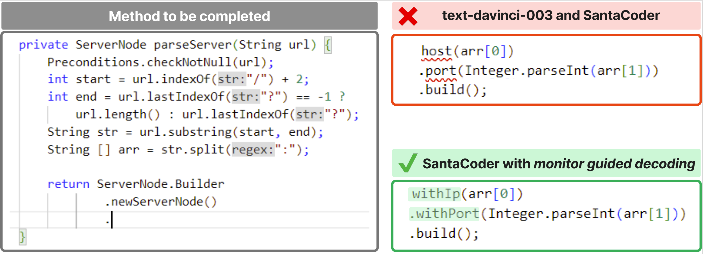

# Monitor-Guided Decoding of Code LMs with Static Analysis of Repository Context
Alternative title: Guiding Language Models of Code with Global Context using Monitors

## Introduction
This repository hosts the official code and data artifact for the paper ["Monitor-Guided Decoding of Code LMs with Static Analysis of Repository Context"](https://neurips.cc/virtual/2023/poster/70362) appearing at NeurIPS 2023 (["Guiding Language Models of Code with Global Context using Monitors"](https://arxiv.org/abs/2306.10763) on Arxiv). The work introduces Monitor-Guided Decoding (MGD) for code generation using Language Models, where a monitor uses static analysis to guide the decoding.

## Repository Contents
1. [Datasets](#1-datasets): PragmaticCode and DotPrompts
2. [Evaluation scripts](#2-evaluation-scripts): Scripts to evaluate LMs by taking as input inferences (code generated by the model) for testcases in DotPrompts and producing score@k scores for the metrics reported in the paper: Compilation Rate (CR), Next-Identifier Match (NIM), Identifier-Sequence Match (ISM) and Prefix Match (PM).
3. [Inference Results over DotPrompts](#3-inference-results-over-dotprompts): generated code for testcases in DotPrompts with various model configurations reported in the paper. The graphs and tables reported in the paper can be reproduced by running the evaluation scripts on the provided inference results.
4. [`multilspy`](#4-multilspy): A language server client, to easily obtain and use results of various static analyses provided by a large variety of language servers that communicate over the [Language Server Protocol](https://microsoft.github.io/language-server-protocol/). `multilspy` is intended to be used as a library to easily query various language servers, without having to worry about setting up their configurations and implementing the client-side of language server protocol. `multilspy` currently supports running language servers for Java, Rust, C# and Python, and we aim to expand this list with the help of the community.
5. [Monitor-Guided Decoding](#5-monitor-guided-decoding): Implementation of various monitors monitoring for different properties reported in the paper (for example: monitoring for type-valid identifier dereferences, monitoring for correct number of arguments to method calls, monitoring for typestate validity of method call sequences, etc.), spanning 3 programming languages.

## Monitor-Guided Decoding: Motivating Example
For example, consider the partial code to be completed in the figure below. To complete this code, an LM has to generate identifiers consistent with the type of the object returned by `ServerNode.Builder.newServerNode()`. The method `newServerNode` and its return type, class `ServerNode.Builder`, are defined in another file. If an LM does not have information about the `ServerNode.Builder type`, it ends up hallucinating, as can be seen in the example generations with the text-davinci-003 and SantaCoder models. The completion uses identifiers `host` and `port`, which do not exist in the type `ServerNode.Builder`. The generated code therefore results in “symbol not found” compilation errors. 

MGD uses static analysis to guide the decoding of LMs, to generate code following certain properties. In the example, MGD is used to monitor for generating code with type-correct dereferences, and the SantaCoder model with the same prompt is able to generate the correct code completion, which compiles and matches the ground truth as well.



## 1. Datasets

### Dataset Statistics
|||
|--------------|:-----:|
| Number of repositories in PragmaticCode |  100 |
| Number of methods in DotPrompts | 1420 |
| Number of testcases in DotPrompts | 10538 |

### PragmaticCode
PragmaticCode is a dataset of real-world open-source Java projects complete with their development environments and dependencies (through their respective build systems). The authors tried to ensure that all the repositories in PragmaticCode were released publicly only after the determined training dataset cutoff date (31 March 2022) for the CodeGen, SantaCoder and text-davinci-003 family of models, which were used to evaluate MGD.

The list of repositories along with their respective licenses consisting PragmaticCode is available in [datasets/PragmaticCode/repos.csv](datasets/PragmaticCode/repos.csv). The contents of the files required for inference for each of the repositories is available in [datasets/PragmaticCode/fileContentsByRepo.json](datasets/PragmaticCode/fileContentsByRepo.json).

### DotPrompts
DotPrompts is a set of testcases derived from PragmaticCode, such that each testcase consists of a prompt to a dereference location (a code location having the "." operator in Java). The scenario described in [motivating example above](#monitor-guided-decoding-motivating-example) is an example of a testcase in DotPrompts. 

The complete description of a testcase in DotPrompts is a tuple - `(repo, classFileName, methodStartIdx, methodStopIdx, dot_idx)`. The dataset is available at [datasets/DotPrompts/dataset.csv](datasets/DotPrompts/dataset.csv).

## 2. Evaluation Scripts
### Environment Setup
We use the Python packages listed in [requirements.txt](requirements.txt). Our experiments used python 3.10. It is recommended to install the same with dependencies in an isolated virtual environment. To create a virtual environment using `venv`:
```setup
python3 -m venv venv_monitors4codegen
source venv_monitors4codegen/bin/activate
```
or using conda:
```
conda create -n monitors4codegen python=3.10
conda activate monitors4codegen
```
Further details and instructions on creation of python virtual environments can be found in the [official documentation](https://docs.python.org/3/library/venv.html). Further, we also refer users to [Miniconda](https://docs.conda.io/en/latest/miniconda.html), as an alternative to the above steps for creation of the virtual environment.

To install the requirements for running evaluations as described [below](#2-evaluation-scripts):

```setup
pip3 install -r requirements.txt
```

### Running the evaluation script
The evaluation script can be run as follows:
```
python3 eval_results.py <path to inference results - csv> <path to PragmaticCode filecontents - json> <path to output directory>
```

The above command will create a directory `<path to output directory>`, containing all the graphs and tables reported in the paper along with extra details. The command also generates a report in the output directory, named `Report.md` which relates the generated figures to sections in the paper. 

To ensure that the environment setup has been done correctly, please run the below command, which runs the evaluation script over dummy data (included in [inference_results/dotprompts_results_sample.csv](inference_results/dotprompts_results_sample.csv)). If the command fails, that indicates an error in the environment setup and the authors request you to kindly report the same.
```
python3 evaluation_scripts/eval_results.py inference_results/dotprompts_results_sample.csv datasets/PragmaticCode/fileContentsByRepo.json results_sample/
```

### Description of `inference results csv` file format
Description of expected columns in the inference results csv input to the evaluation script:
* `repo`: Name of the repository from which the testcase was sourced
* `classFileName`: relative path to file containing the testcase prompt location
* `methodStartIdx`: String index of starting `'{'` of the method
* `methodStopIdx`: String index of closing `'}'` of the method
* `dot_idx`: String index of `'.'` that is the dereference prompt point
* `configuration`: Identifies the configuration used to generate the given code sample. Values from: `['SC-classExprTypes', 'CG-6B', 'SC-FIM-classExprTypes', 'SC-RLPG-MGD', 'SC-MGD', 'SC-FIM-classExprTypes-MGD', 'CG-2B', 'SC', 'CG-2B-MGD', 'CG-350M-classExprTypes-MGD', 'SC-FIM', 'TD-3', 'CG-350M-MGD', 'SC-FIM-MGD', 'SC-RLPG', 'CG-350M', 'CG-350M-classExprTypes', 'SC-classExprTypes-MGD', 'CG-6B-MGD', 'TD-3-MGD']`
* `temperature`: Temperature used for sampling. Values from: `[0.8, 0.6, 0.4, 0.2]`
* `model`: Name of the model used for sampling. Values from: `['Salesforce/codegen-6B-multi', 'bigcode/santacoder', 'Salesforce/codegen-2B-multi', 'Salesforce/codegen-350M-multi', 'text-davinci-003']`
* `context`: Decoding strategy used. Values from: `['autoregressive', 'fim']`
* `prefix`: Prompt strategy used. Values from: `['classExprTypes', 'none', 'rlpg']`
* `rlpg_best_rule_name`: Name of the rule used for creating RLPG prompt (if used for the corresponding testcase). Values from: `[nan, 'in_file#lines#0.25', 'in_file#lines#0.5', 'in_file#lines#0.75', 'import_file#method_names#0.5']`
* `output`: Generated output by the model
* `compilationSucceeded`: Result of compiling the generated method in the context of the full repository. 1 if success, 0 otherwise. Values from: `[1, 0]`

## 3. Inference Results over DotPrompts
We provide all inferences (generated code) generated by all model configurations reported in the paper, for every testcase in DotPrompts. This consists of 6 independently sampled inferences for 18 different model configurations (spanning parameter scale, prompt templates, use of FIM context, etc.) for every testcase in DotPrompts.

The generated samples along with their compilation status, following the format described [above](#description-of-inference-results-csv-file-format), is available at [inference_results/dotprompts_results.csv](inference_results/dotprompts_results.csv). The file is stored using [git lfs](https://git-lfs.com/). If the file is not available locally after cloning this repository, please check the [git lfs website](https://git-lfs.com/) for instructions on setup, and clone the repository again after git lfs setup.

Each row in the file contains several multi-line string cells, and therefore, while viewing them in tools like Microsoft Office Excel, kindly enable "Word Wrap" to be able to view the full contents.

To run the [evaluation scripts](#2-evaluation-scripts) over the inferences, in order to reproduce the graphs and tables reported in the paper, run:
```
python3 evaluation_scripts/eval_results.py inference_results/dotprompts_results.csv datasets/PragmaticCode/fileContentsByRepo.json results/
```

The above command creates a directory [results](results/) (already included in the repository), containing all the figures and tables provided in the paper along with extra details. The command also generates a report in the output directory which relates the generated figures to sections in the paper. In case of above command, the report is generated at [results/Report.md](results/Report.md).

## 4. `multilspy`
`multilspy` is a cross-platform library to set up and interact with various language servers in a unified and easy way. [Language servers]((https://microsoft.github.io/language-server-protocol/overviews/lsp/overview/)) are tools that perform a variety of static analyses on source code and provide useful information such as type-directed code completion suggestions, symbol definition locations, symbol references, etc., over the [Language Server Protocol (LSP)](https://microsoft.github.io/language-server-protocol/overviews/lsp/overview/). `multilspy` intends to ease the process of using language servers, by abstracting the setting up of the language servers, performing language-specific configuration and handling communication with the server over the json-rpc based protocol, while exposing a simple interface to the user.

Since LSP is language-agnostic, `multilspy` can provide the results for static analyses of code in different languages over a common interface. `multilspy` is easily extensible to any language that has a Language Server and currently supports Java, Rust, C# and Python and we aim to support more language servers from the [list of language server implementations](https://microsoft.github.io/language-server-protocol/implementors/servers/).

Some of the analyses results that `multilspy` can provide are:
- Finding the definition of a function or a class ([textDocument/definition](https://microsoft.github.io/language-server-protocol/specifications/lsp/3.17/specification/#textDocument_definition))
- Finding the callers of a function or the instantiations of a class ([textDocument/references](https://microsoft.github.io/language-server-protocol/specifications/lsp/3.17/specification/#textDocument_references))
- Providing type-based dereference completions ([textDocument/completion](https://microsoft.github.io/language-server-protocol/specifications/lsp/3.17/specification/#textDocument_completion))

### Installation
To install `multilspy` using pip, execute the following command:
```
pip install https://github.com/microsoft/monitors4codegen/archive/main.zip
```

### Usage
Example usage:
```python
from monitors4codegen.multilspy import SyncLanguageServer
from monitors4codegen.multilspy.multilspy_config import MultilspyConfig
from monitors4codegen.multilspy.multilspy_logger import MultilspyLogger
...
config = MultilspyConfig.from_dict({"code_language": "java"}) # Also supports "python", "rust", "csharp"
logger = MultilspyLogger()
lsp = SyncLanguageServer.create(config, logger, "/abs/path/to/project/root/")
with lsp.start_server():
    result = lsp.request_definition(
        "relative/path/to/code_file.java", # Filename of location where request is being made
        163, # line number of symbol for which request is being made
        4 # column number of symbol for which request is being made
    )
    result2 = lsp.request_completions(
        ...
    )
    result3 = lsp.request_references(
        ...
    )
    ...
```

`multilspy` also provides an asyncio based API which can be used in async contexts. Example usage (asyncio):
```python
from monitors4codegen.multilspy import LanguageServer
...
lsp = LanguageServer.create(...)
async with lsp.start_server():
    result = await lsp.request_definition(
        ...
    )
    ...
```

The file [src/monitors4codegen/multilspy/language_server.py](src/monitors4codegen/multilspy/language_server.py) provides the `multilspy` API. Several tests for `multilspy` present under [tests/multilspy/](tests/multilspy/) provide detailed usage examples for `multilspy`. The tests can be executed by running:
```bash
pytest tests/multilspy
```

## 5. Monitor-Guided Decoding

A monitor under the Monitor-Guided Decoding framework, is instantiated using `multilspy` as the LSP client, and as a logits-processor to guide the LM decoding. [monitor_guided_decoding/monitor.py](monitor_guided_decoding/monitor.py) provides the class `MGDLogitsProcessor` which can be used with any HuggingFace Language Model, as a `LogitsProcessor` to guide the LM using MGD. [src/monitors4codegen/monitor_guided_decoding/dereferences_monitor.py](src/monitors4codegen/monitor_guided_decoding/dereferences_monitor.py) provides the instantiation for dereferences monitor. Unit tests for the dereferences monitor are present in [tests/monitor_guided_decoding/test_dereferences_monitor_java.py](tests/monitor_guided_decoding/test_dereferences_monitor_java.py), which also provide usage examples for the dereferences monitor.

## Contributing

This project welcomes contributions and suggestions.  Most contributions require you to agree to a
Contributor License Agreement (CLA) declaring that you have the right to, and actually do, grant us
the rights to use your contribution. For details, visit https://cla.opensource.microsoft.com.

When you submit a pull request, a CLA bot will automatically determine whether you need to provide
a CLA and decorate the PR appropriately (e.g., status check, comment). Simply follow the instructions
provided by the bot. You will only need to do this once across all repos using our CLA.

This project has adopted the [Microsoft Open Source Code of Conduct](https://opensource.microsoft.com/codeofconduct/).
For more information see the [Code of Conduct FAQ](https://opensource.microsoft.com/codeofconduct/faq/) or
contact [opencode@microsoft.com](mailto:opencode@microsoft.com) with any additional questions or comments.

## Trademarks

This project may contain trademarks or logos for projects, products, or services. Authorized use of Microsoft 
trademarks or logos is subject to and must follow 
[Microsoft's Trademark & Brand Guidelines](https://www.microsoft.com/en-us/legal/intellectualproperty/trademarks/usage/general).
Use of Microsoft trademarks or logos in modified versions of this project must not cause confusion or imply Microsoft sponsorship.
Any use of third-party trademarks or logos are subject to those third-party's policies.
